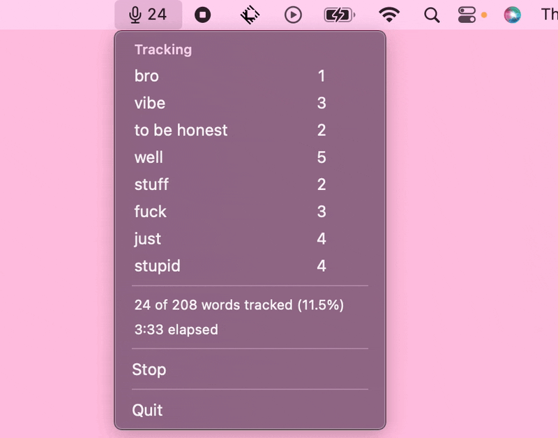
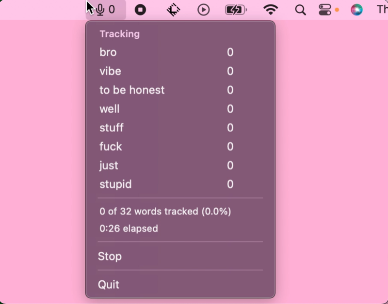
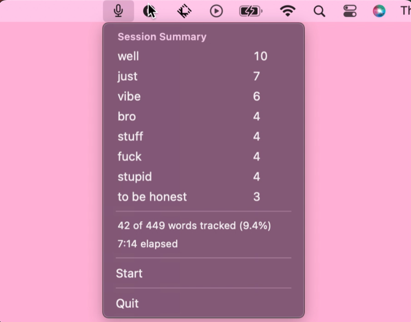

# Verbal Habits

## Description

Menu bar app for tracking word usage — helping to see undesirable vocabulary
in your speech, and to reduce it. Turn it on and it listens, transcribes your
speech on device, and keeps a running count of every word on your tracked
list. The count in the menu bar rises as each stretch of speech is counted,
and the session ends with a summary of the totals.

## Demo



A tracked word is an entry on the list the app counts. The app takes your
speech in stretches and counts each one as it finishes, so the numbers jump a
few at a time while you talk.

| At the start of a session                                           | After a stop                                                |
| ------------------------------------------------------------------- | ----------------------------------------------------------- |
|                 |   |
| A live session 26 seconds in: 32 words heard, no tracked words yet. | Rows sorted by count, over the totals and the elapsed time. |

## Features

- **On-device speech to text**: [`src/audio.py`](src/audio.py) listens through
  your microphone and turns your speech into text on your own machine. Nothing
  you say is sent to a server, and the microphone shuts off when you press
  Stop.
- **The whole app is in the menu bar**: the running count sits beside the
  microphone icon, and clicking it drops down the tracked list, the totals, and
  the Start or Stop control. A menu left open re-reads every number once a
  second while a session runs.
- **Tracked words counted as you talk**: the total rises while you speak, and
  the menu breaks it down word by word.
- **Your habit as a share of your speech**: the menu holds how many words you
  said, how many of them were tracked ones, and the percentage that came to —
  `12 of 843 words tracked (1.4%)` — over the elapsed time.
- **A summary when you stop**: the totals freeze and the rows sort by count, so
  the habit you leaned on hardest comes to the top.
- **Phrases and word forms count as one habit**: an entry may be several words
  long, and each gathers its other forms, e.g "to be honest" is one habit and
  "vibe" also counts "vibes", "vibing". Configurable at
  [`src/config.py`](src/config.py).
- **Permissions checked before a session starts**: the app confirms it has
  microphone and speech recognition access before it opens the microphone, and
  asks for whichever it has yet to be granted. If either is turned off, an
  alert and the menu both say which one, with a link straight to the System
  Settings pane where you can turn it on.
- **A session that stops early says why**: if speech recognition fails or the
  microphone stops sending audio, the app notices within 5 seconds, ends the
  session, and names the cause in the menu and an alert. Everything counted so
  far is kept, so the number in the menu bar is never one the app quietly
  stopped updating.

## Local Development

#### Requirements:

- macOS. The app is built directly on Apple's Speech and AVFoundation
  frameworks, so there is no cross-platform path. It was developed and tested
  on macOS 13. The frameworks it calls reach back to macOS 10.15, so earlier
  versions may work, and none have been tried.
- Python 3.12, the version every spike measurement was taken on. The pinned
  PyObjC release needs 3.10 or newer.
- Terminal.app. An editor's integrated terminal may not declare
  `NSSpeechRecognitionUsageDescription`, and macOS ends the process without a
  message when the launching application is missing it.
  > [!NOTE]
  > Packaging the app as its own signed application removes this.

Those spike measurements, and the design decisions they settled, are written up
in [`docs/`](docs/README.md).

#### Typical Development Workflow:

1. Create and activate the virtual environment:

   ```
   python3.12 -m venv venv
   source venv/bin/activate
   ```

2. Install runtime and development dependencies:

   ```
   pip install -r requirements-dev.txt
   ```

3. Run the tests:

   ```
   pytest
   ```

4. Run the app:

   ```
   python src/app.py
   ```

   The first start asks for microphone and speech recognition access, which
   macOS holds on separate System Settings panes.

5. Run the app with diagnostics:

   ```
   VERBAL_HABITS_DEBUG=1 python src/app.py
   ```

   Every transcript, each segment as it commits, and a count of the audio
   arriving from the microphone are written to the terminal with timestamps.
   A microphone that goes quiet is reported whether or not this is set.

## Contributing

This is a portfolio project, but feedback is welcome! Open an issue or submit a PR.

## Author

Audrey - [GitHub](https://github.com/audreycode6) | [LinkedIn](https://www.linkedin.com/in/audrey-theriault-allaire/)
